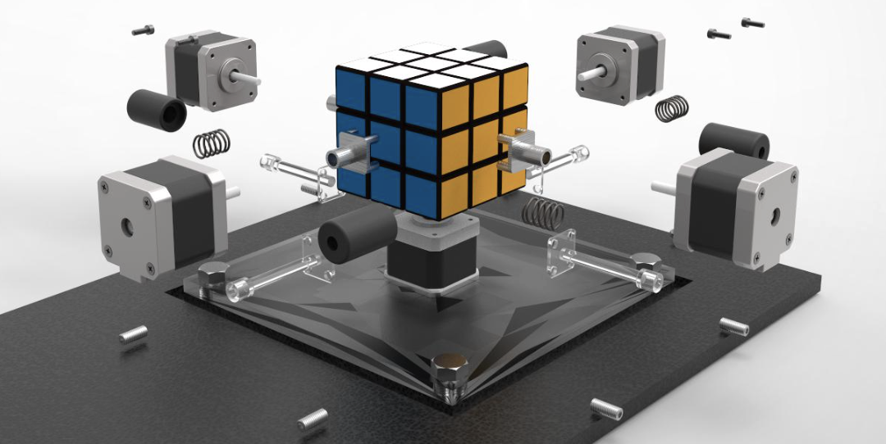

<h1 align="center">
  <b>DeepCubeA: Reimplementation of Heuristic Search-Based Rubik’s Cube Solver</b><br>
  <a href="https://github.com/SakanaAI/AI-Scientist/blob/main/docs/logo_2.png">
    </a><br>
</h1>


<p align="center">
<a href="https://github.com/xiaofeng218/DeepcubeA">
  
</a>
<a href='https://huggingface.co/spaces/Hanxiaofeng123/Deepcube'></a>
<a href="https://cse.sc.edu/~foresta/assets/files/SolvingTheRubiksCubeWithDeepReinforcementLearningAndSearch_Final.pdf">
  
</a>
</p>


This project is a reimplementation of [DeepCubeA](https://cse.sc.edu/~foresta/assets/files/SolvingTheRubiksCubeWithDeepReinforcementLearningAndSearch_Final.pdf). Training is based on the PyTorch Lightning framework. The method combines deep reinforcement learning and search algorithms to solve the Rubik’s Cube. The original paper demonstrates how neural networks and search techniques can be combined to solve complex combinatorial optimization problems such as the Rubik’s Cube.

## Table of Contents

- [Requirements](#requirements)
  - [Installation](#installation)
- [Usage](#usage)
  - [Web Application](#1-web-application)
  - [Inference](#2-inference)
- [Training](#training)
  - [Configuration Parameters for Training](#configuration-parameters-for-trainging)
- [Implementation Details](#implementation-details)
- [Results](#results)
  - [Training Results](#training-results)
  - [Test Results (Final Converged Model with K=30)](#test-results-final-converged-model-with-k30)
  - [Performance Analysis](#performance-analysis)
- [Citation](#citation)


## Requirements

This code is designed to run on Linux with NVIDIA GPUs using CUDA and PyTorch. We test the code on Python 3.10.16 and PyTorch 2.5.1. If you only have CPU or older versions of these libraries, you may need to modify the code accordingly. 

### Installation

1. Clone the repository:

```bash
git clone https://github.com/xiaofeng218/DeepcubeA.git
cd DeepcubeA
```

2. Create an environment and install dependencies:

```bash
conda create -n deepcubea python=3.10.16
conda activate deepcubea
conda install pytorch==2.5.1 torchvision==0.20.1 torchaudio==2.5.1 pytorch-cuda=12.1 -c pytorch -c nvidia
pip install -r requirements.txt
```

## Usage

Download the pretrained [final_model_K_30.pth](https://drive.google.com/file/d/1jdmdoXkkJb7sNq6oy-iudtnVIgQXDsLl/view?usp=drive_link) model and place it in the `checkpoint` folder. Then Update `model_path` in `config.py` to `checkpoint/final_model_K_30.pth`.

#### Web Application

Run `app.py` to launch the web app:

```bash
python app.py
```

Open `http://localhost:5000` in your browser to access the application.

#### Inference

Randomly scramble and solve:

```bash
python inference.py
```

Specify an initial scramble using actions: `U, R, F, D, L, B, U_inv, R_inv, F_inv, D_inv, L_inv, B_inv`. Separate actions with spaces.

```bash
python inference.py --actions "U R F D L_inv B_inv"
```

After running `inference.py`, an HTML file `rubiks_solution.html` will be generated to visualize the solving process.

## Training
We also provide a script to train the model from scratch. Simply run:

```bash
python train.py
```

#### Configuration Parameters for Trainging

Main configuration parameters (defined in `config.py`):

* `--batch_size`: Training batch size (default: 10000)
* `--num_workers`: Number of data loader workers (default: 16)
* `--K`: Maximum scramble length (default: 30)
* `--max_epochs`: Maximum training epochs (default: 100)
* `--learning_rate`: Learning rate (default: 1e-3)
* `--convergence_threshold`: Convergence threshold (default: 0.05)
* `--compile`: Whether to use compiled model acceleration (default: True)

## Implementation Details

For detailed implementation and algorithm explanation, see [Implement.md](Implement.md), including:

* Rubik’s Cube state representation
* Action representation
* Deep Approximate Value Iteration algorithm
* Training pseudocode
* BWAS search algorithm
* Neural network architecture

## Results

### Training Results

Number of epochs required for different K values to converge (loss < 0.05, `1000 steps/epoch`):


As shown, the number of epochs required grows exponentially with increasing K. Due to computational cost, training beyond K>15 was capped at 20 epochs instead of full convergence.

### Test Results (Final Converged Model with K=30)

#### Model predictions of cost-to-go for states with different scramble lengths (mean, max):


#### Example: Solving a cube scrambled with 100 steps

Since training was not strictly aligned with the original convergence settings, the model performance is somewhat weaker than reported in the paper. Example case:

| Metric               | Value                                                                                                                                                                    |
| -------------------- | ------------------------------------------------------------------------------------------------------------------------------------------------------------------------ |
| Scramble length      | 100                                                                                                                                                                      |
| Solution path length | 23                                                                                                                                                                       |
| Solve time           | 7.6645 s                                                                                                                                                                 |
| Solution path        | `['D_inv', 'R', 'U_inv', 'F', 'L_inv', 'R', 'B_inv', 'L_inv', 'U_inv', 'F', 'B_inv', 'D_inv', 'L_inv', 'F_inv', 'R', 'F', 'L_inv', 'F_inv', 'R_inv', 'D_inv', 'B', 'U']` |

[View Rubik’s Cube solving process](https://xiaofeng218.github.io/DeepcubeA/assets/rubiks_solution.html)

#### Performance Analysis

Built a test set of 200 cubes scrambled 1000–10000 steps, solved with A* algorithm:

> * Total test cases: 200
> * Hardware: NVIDIA A100
> * Hyperparameters: N=1000, $\lambda=0.6$
> * A* max iterations: 200
> * Successfully solved: 191
> * Success rate: 95.50%
> * Average scramble length: 5446.30
> * Average solution length: 22.30
> * Average solve time: 13.10 s
> * Max solution length: 25

## Citation

If you use this project in your research, please cite the original paper:

```bibtex
@article{agostinelli2019solving,
  title={Solving the Rubik’s cube with deep reinforcement learning and search},
  author={Agostinelli, Forest and McAleer, Stephen and Shmakov, Alexander and Baldi, Pierre},
  journal={Nature Machine Intelligence},
  volume={1},
  number={8},
  pages={356--363},
  year={2019},
  publisher={Nature Publishing Group UK London}
}
```

